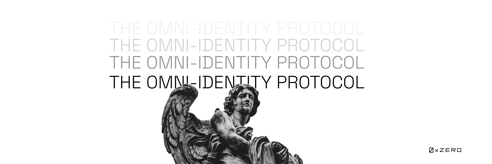

# Introduction

<figure><figcaption></figcaption></figure>

## The Paradox of Web3 Identity

Web3 thrives on a paradox. It empowers users with data ownership, disrupting traditional control by fostering a permissionless ecosystem. Yet, this very autonomy clashes with regulations and law enforcement's need for user data to combat theft and fraud. Data brokers exploit this tension, profiting from information web3 aims to return to users.

## The Solution

ZERO Protocol, a decentralised identity and verifiable credential protocol that aims to unlock real-world value for Web3 through zero-knowledge, enabling solvency aggregation, and attestation.

It aims to provide a system whereby users have complete self-sovereignty over their identity and credential data. Our mission at ZERO is to also enable proving of dynamic user data through our dynamic credential module, hence opening the door to solvency proof, aggregated internet data, powering everything comprising a user’s data on the open web.

\
