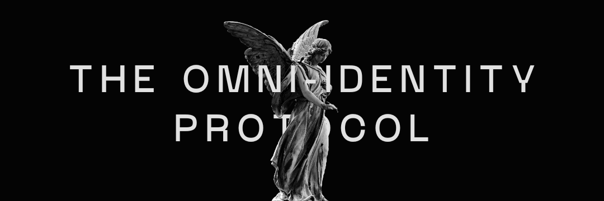

# ZERO Overview

<figure><figcaption></figcaption></figure>

## The Paradox of DeFi Identity

In our data-driven world, the web3 industry presents a fascinating paradox. It thrives by empowering users with control over their data, fostering a permissionless ecosystem that disrupts traditional gatekeepers. However, this very autonomy can create challenges. Regulations and law enforcement agencies, with the legitimate goal of preventing theft and fraud, often rely on user data collection, a practice at odds with web3's core principles. Data brokers exemplify this tension, exploiting user data for profit while web3 strives to return ownership to individuals.

Finding a solution requires navigating a delicate balance. DeFi needs a robust Know Your Customer (_**KYC**_) attestation protocol that is both effective and privacy-preserving. This protocol would bridge the gap between off-chain identities used in traditional finance and on-chain identities within web3. Ideally, such a system would ensure compliance with regulations while minimizing the amount of user data exposed and empowering users to control how their information is used. Additionally, it should consider mechanisms to assess the financial health of participants both off-chain and on-chain across the board, potentially mitigating solvency risks and misaligned financial capabilities within the DeFi ecosystem.

## The ZERO Solution

### zk-Powered Identities

### Omnichain Passports

### Aggregated Verifications

### Protocol Governance ($ZERO)

