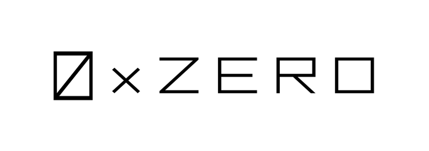
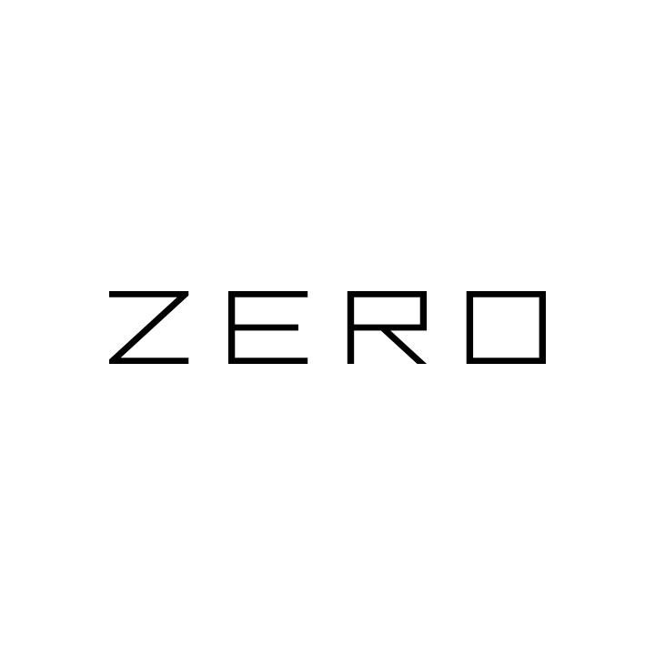
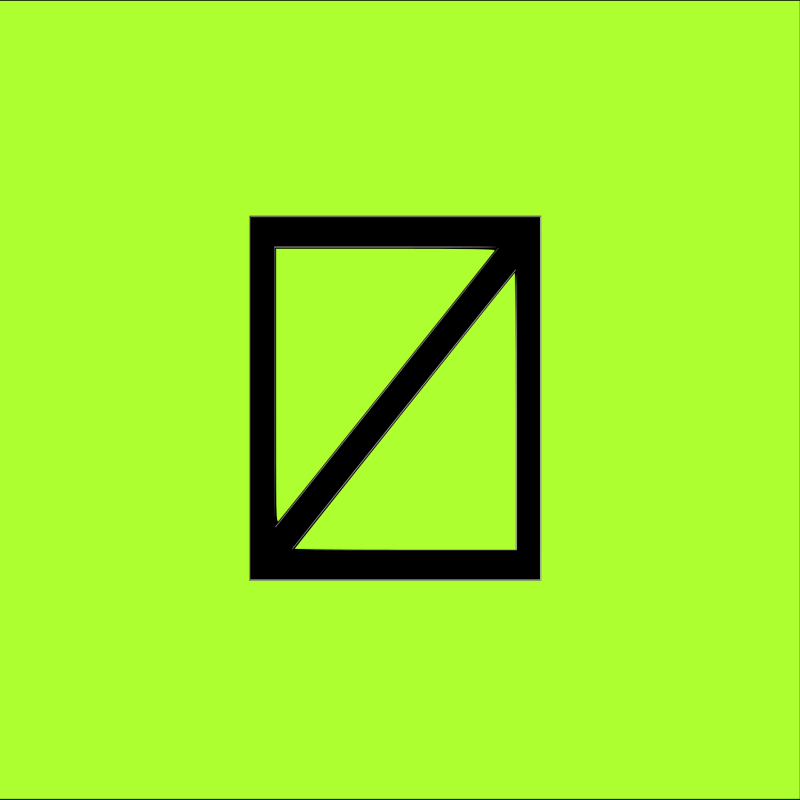
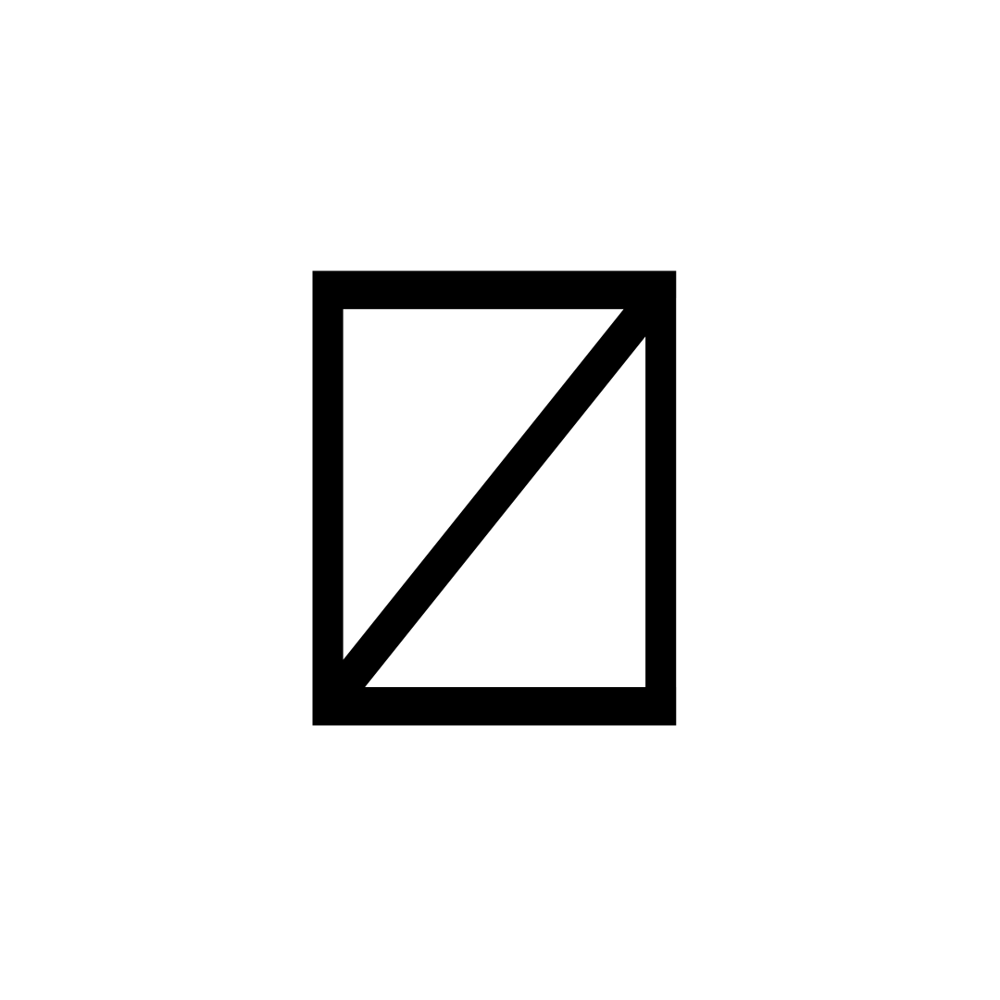

# Press Kit

### ZERO Labs

<figure><figcaption>
A logo representation of our domain
</figcaption></figure>

<figure><figcaption>
Icon logo—ZERO Labs
</figcaption></figure>

<figure><figcaption>
Text logo—ZERO Labs
</figcaption></figure>

### ZERO Protocol

<figure><figcaption>
Icon logo—ZERO Protocol
</figcaption></figure>

<figure><figcaption>
Text logo—ZERO Protocol
</figcaption></figure>

### OMID Wallet

<figure><figcaption>
Icon logo—OMID Wallet
</figcaption></figure>

### Extras

<figure><figcaption>
Domain logo—no bg, white
</figcaption></figure>

<figure><figcaption>
Icon logo—no bg, black
</figcaption></figure>

<figure><figcaption>
Icon logo—no bg, white
</figcaption></figure>

### Symbol - (Σ, ∆)

It's a silly play of mathematics symbols. Σ, used to denote summation is close to being the direct opposite of ∆, which is used to denote difference. Take it as you may, give it whatever interpretation comes to mind.. it merely acts as a tool for distinctive branding.
